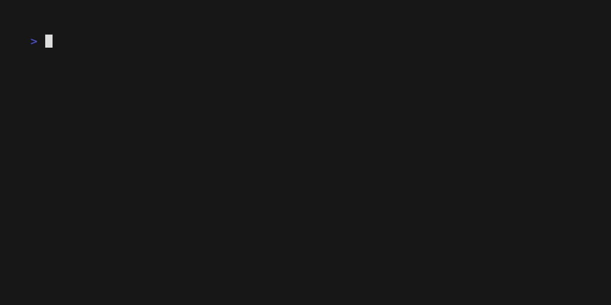

# FoC

Foundation of Cybersecuity project 2022-2023.

A Secure Bank Application (SBA) is a client-server application that allows users to issue operations ontheir own bank accounts.

## Demo



## Info

The application relys in a custom protocol developed using OpenSSL library. Using symmetric and asymmetric encryption the protocol guarantees that the comunication is onfidential, authenticated,  and  protected against replay. For more information about the specification read the [documentation.pdf](docs/documentation.pdf) file


## Requirements

```shell
sudo apt install libssl-dev
sudo apt install libjsoncpp-dev
sudo apt install libncurses5-dev libncursesw5-dev
```

## Run 

```
make build
./build/generator
./build/server
./build/client username
```