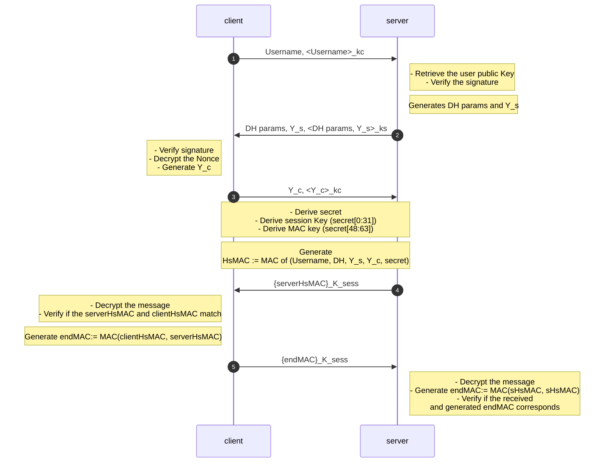

```mermaid
sequenceDiagram
autonumber
    participant client
    participant server
    
    client ->> server:        Username, <Username>_kc
    Note right of server:     - Retrieve the user public Key <br/> - Verify the signature
    Note right of server:     Generates DH params and Y_s
    server ->> client:        DH params, Y_s, <DH params, Y_s>_ks
    Note left of client:      - Verify signature <br/>- Decrypt the Nonce<br/>- Generate Y_c
    client ->> server:        Y_c, <Y_c>_kc

    Note over client,server:  - Derive secret<br/>- Derive session Key (secret[0:31])<br/>- Derive MAC key (secret[48:63])
    
    Note over client,server: Generate <br/>HsMAC := MAC of (Username, DH, Y_s, Y_c, secret)

    server ->> client:        {serverHsMAC}_K_sess
    Note left of client:      - Decrypt the message<br/>- Verify if the serverHsMAC and clientHsMAC match

    Note left of client:      Generate endMAC:= MAC(clientHsMAC, serverHsMAC)
    
    client ->> server:        {endMAC}_K_sess
    Note right of server:     - Decrypt the message<br/>- Generate endMAC:= MAC(sHsMAC, sHsMAC)<br/>- Verify if the received <br/>and generated endMAC corresponds
```
