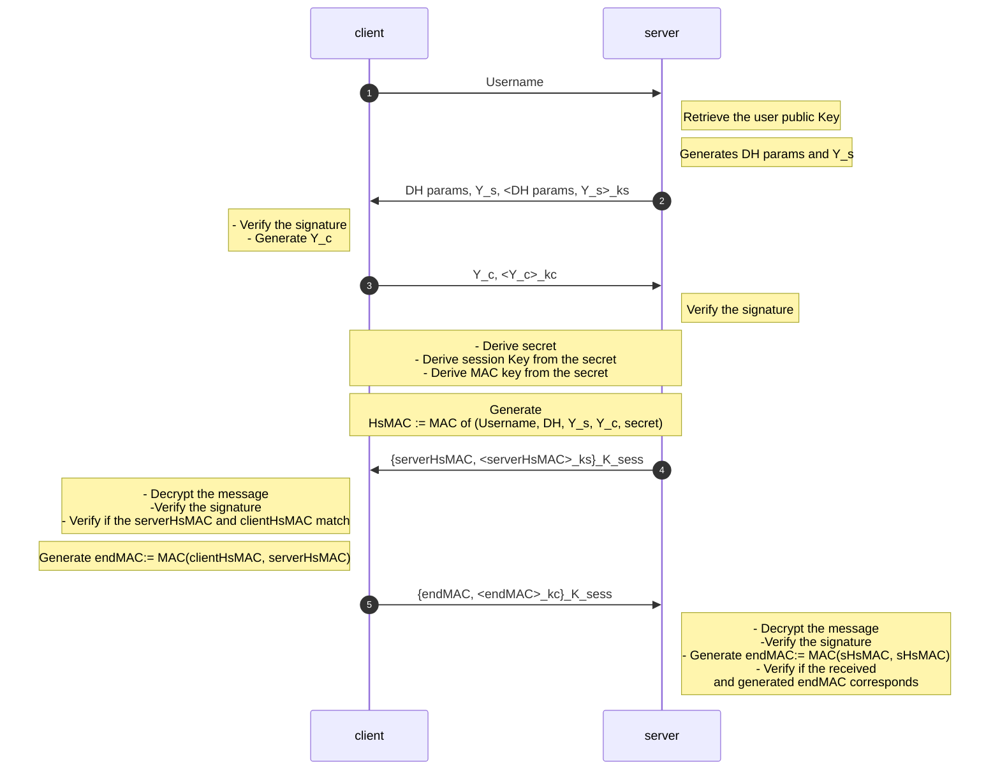

```mermaid
sequenceDiagram
autonumber
    participant client
    participant server
    
    client ->> server:        Username
    Note right of server:     Retrieve the user public Key
    Note right of server:     Generates DH params and Y_s
    server ->> client:        DH params, Y_s, <DH params, Y_s>_ks
    Note left of client:      - Verify the signature <br/>- Generate Y_c
    client ->> server:        Y_c, <Y_c>_kc
    
    Note right of server:     Verify the signature

    Note over client,server:  - Derive secret<br/>- Derive session Key from the secret<br/>- Derive MAC key from the secret
    
    Note over client,server: Generate <br/>HsMAC := MAC of (Username, DH, Y_s, Y_c, secret)

    server ->> client:        {serverHsMAC, <serverHsMAC>_ks}_K_sess
    Note left of client:      - Decrypt the message<br/>-Verify the signature<br/>- Verify if the serverHsMAC and clientHsMAC match

    Note left of client:      Generate endMAC:= MAC(clientHsMAC, serverHsMAC)
    
    client ->> server:        {endMAC, <endMAC>_kc}_K_sess
    Note right of server:     - Decrypt the message<br/>-Verify the signature<br/>- Generate endMAC:= MAC(sHsMAC, sHsMAC)<br/>- Verify if the received <br/>and generated endMAC corresponds
```
